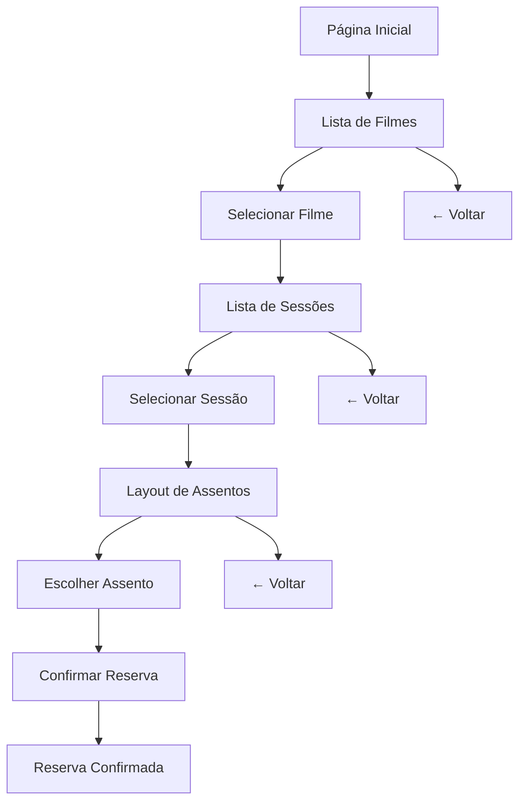

# 🎬 Cinema Paradiso - Sistema de Reservas de Cinema

[](https://nodejs.org/)
[](https://reactjs.org/)
[](https://expressjs.com/)
[](https://www.mysql.com/)

Um sistema completo de reservas de cinema desenvolvido com **React** (frontend) e **Node.js/Express** (backend), permitindo aos usuários visualizar filmes, sessões e reservar assentos de forma intuitiva.

## 📋 Índice

- [🎯 Sobre o Projeto](#-sobre-o-projeto)
- [🚀 Funcionalidades](#-funcionalidades)
- [🛠️ Tecnologias Utilizadas](#️-tecnologias-utilizadas)
- [📁 Estrutura do Projeto](#-estrutura-do-projeto)
- [⚙️ Instalação e Configuração](#️-instalação-e-configuração)
- [🎮 Como Usar](#-como-usar)
- [🔧 Configuração do Banco de Dados](#-configuração-do-banco-de-dados)
- [📡 API Endpoints](#-api-endpoints)
- [🎨 Interface do Usuário](#-interface-do-usuário)
- [🔄 Fluxo da Aplicação](#-fluxo-da-aplicação)
- [🐛 Solução de Problemas](#-solução-de-problemas)
- [📈 Melhorias Futuras](#-melhorias-futuras)
- [🤝 Contribuição](#-contribuição)
- [📄 Licença](#-licença)

## 🎯 Sobre o Projeto

O **Cinema Reservas** é uma aplicação web moderna que simula um sistema real de reservas de cinema. O projeto foi desenvolvido com foco em:

- **Experiência do usuário**: Interface intuitiva e responsiva
- **Arquitetura escalável**: Backend modular e bem estruturado
- **Dados mockados**: Funcionalidade completa sem dependência de banco de dados
- **Código limpo**: Padrões de desenvolvimento modernos

### 🎬 Demonstração

A aplicação permite:

1. **Visualizar filmes** em cartaz
2. **Selecionar sessões** disponíveis
3. **Escolher assentos** em um layout visual da sala
4. **Fazer reservas** com confirmação

## 🚀 Funcionalidades

### ✅ Implementadas

- [x] Listagem de filmes em cartaz
- [x] Visualização de sessões por filme
- [x] Layout interativo de assentos da sala
- [x] Sistema de reservas com confirmação
- [x] Interface responsiva
- [x] Dados mockados para demonstração
- [x] Tratamento de erros
- [x] Loading states
- [x] Navegação intuitiva

### 🔄 Funcionalidades Técnicas

- [x] API RESTful completa
- [x] Arquitetura MVC no backend
- [x] Componentes React reutilizáveis
- [x] Tratamento de estados assíncronos
- [x] Sistema de fallback para dados mockados
- [x] Configuração de ambiente (.env)

## 🛠️ Tecnologias Utilizadas

### Frontend

- **React 18+** - Biblioteca JavaScript para interfaces
- **Axios** - Cliente HTTP para requisições à API
- **CSS3** - Estilização moderna e responsiva
- **Create React App** - Configuração inicial do projeto

### Backend

- **Node.js** - Runtime JavaScript
- **Express.js** - Framework web
- **MySQL2** - Driver MySQL para Node.js
- **CORS** - Middleware para requisições cross-origin
- **Dotenv** - Gerenciamento de variáveis de ambiente

### Desenvolvimento

- **Nodemon** - Reinicialização automática do servidor
- **Git** - Controle de versão
- **ES6+** - Recursos modernos do JavaScript

## 📁 Estrutura do Projeto

```
cinema-reservas/
├── 📁 backend/                    # Servidor Node.js/Express
│   ├── 📁 src/
│   │   ├── 📁 config/            # Configurações (banco de dados)
│   │   ├── 📁 controllers/       # Controladores da API
│   │   ├── 📁 repositories/      # Camada de acesso a dados
│   │   ├── 📁 routes/            # Definição de rotas
│   │   ├── 📁 services/          # Lógica de negócio
│   │   └── 📁 database/          # Schema do banco de dados
│   ├── 📄 package.json
│   └── 📄 .env                   # Variáveis de ambiente
├── 📁 frontend/                   # Aplicação React
│   ├── 📁 public/                # Arquivos públicos
│   ├── 📁 src/
│   │   ├── 📁 components/        # Componentes React
│   │   ├── 📁 services/          # Serviços de API
│   │   └── 📄 App.js             # Componente principal
│   └── 📄 package.json
├── 📄 .gitignore                 # Arquivos ignorados pelo Git
└── 📄 README.md                  # Este arquivo
```

## ⚙️ Instalação e Configuração

### Pré-requisitos

- **Node.js** 18+ ([Download](https://nodejs.org/))
- **npm** ou **yarn**
- **Git** ([Download](https://git-scm.com/))

### 1. Clone o Repositório

```bash
git clone <URL_DO_REPOSITORIO>
cd cinema-reservas
```

### 2. Configure o Backend

```bash
cd backend
npm install
```

### 3. Configure o Frontend

```bash
cd ../frontend
npm install
```

### 4. Configure as Variáveis de Ambiente

Crie o arquivo `backend/.env`:

```env
DB_HOST=localhost
DB_USER=root
DB_PASSWORD=sua_senha
DB_NAME=cinema_db
PORT=3001
```

### 5. Execute a Aplicação

#### Terminal 1 - Backend

```bash
cd backend
npm run dev
```

Servidor rodando em: <http://localhost:3001>

#### Terminal 2 - Frontend

```bash
cd frontend
npm start
```

Aplicação rodando em: <http://localhost:3000>

## 🎮 Como Usar

### 1. Acesse a Aplicação

Abra <http://localhost:3000> no seu navegador

### 2. Escolha um Filme

- Visualize a lista de filmes em cartaz
- Clique no filme desejado

### 3. Selecione uma Sessão

- Veja as sessões disponíveis para o filme
- Escolha data, horário e sala
- Clique na sessão desejada

### 4. Reserve seu Assento

- Visualize o layout da sala
- Assentos verdes = disponíveis
- Assentos vermelhos = ocupados
- Clique em um assento verde
- Confirme a reserva

### 5. Navegação

- Use o botão "← Voltar" para navegar entre as telas
- A aplicação mantém o estado durante a navegação

## 🔧 Configuração do Banco de Dados

### Opção 1: Usar Dados Mockados (Recomendado para Teste)

A aplicação funciona perfeitamente com dados mockados, sem necessidade de banco de dados.

### Opção 2: Configurar MySQL

1. **Instale o MySQL**
2. **Execute o script SQL**:

```bash
mysql -u root -p < backend/src/database/schema.sql
```

3. **Configure as credenciais** no arquivo `backend/.env`

## 📡 API Endpoints

### Filmes

```http
GET /api/filmes
```

**Resposta:**

```json
{
  "filmes": [
    {
      "id": 1,
      "nome": "Avatar: O Caminho da Água",
      "genero": "Ficção Científica",
      "duracao": 192,
      "ativo": true
    }
  ]
}
```

### Sessões

```http
GET /api/filmes/{filmeId}/sessoes
```

**Resposta:**

```json
{
  "filme": { ... },
  "sessoes": [
    {
      "id": 1,
      "sala_nome": "Sala 1",
      "data": "2025-08-22",
      "horario": "14:30:00",
      "capacidade": 50
    }
  ]
}
```

### Assentos

```http
GET /api/sessoes/{sessaoId}/assentos
```

**Resposta:**

```json
{
  "sessao": { ... },
  "layout": {
    "fileiras": ["A", "B", "C", "D", "E"],
    "assentos_por_fileira": 10,
    "assentos": [
      {
        "id": 1,
        "numero": "1",
        "fileira": "A",
        "status": "livre"
      }
    ]
  }
}
```

### Reservas

```http
POST /api/sessoes/{sessaoId}/reservas
Content-Type: application/json

{
  "assento_id": 1
}
```

## 🎨 Interface do Usuário

### Design Responsivo

- **Desktop**: Layout otimizado para telas grandes
- **Tablet**: Adaptação para telas médias
- **Mobile**: Interface mobile-first

### Cores e Estados

- 🟢 **Verde**: Assentos livres (clicáveis)
- 🔴 **Vermelho**: Assentos ocupados (não clicáveis)
- ⚫ **Cinza**: Assentos em manutenção

### Componentes Principais

- **ListaFilmes**: Grid responsivo de filmes
- **ListaSessoes**: Cards de sessões disponíveis
- **LayoutAssentos**: Visualização interativa da sala

## 🔄 Fluxo da Aplicação



## 🐛 Solução de Problemas

### Problemas Comuns

#### 1. "Cannot find module"

```bash
# Reinstale as dependências
cd backend && npm install
cd ../frontend && npm install
```

#### 2. "Port already in use"

```bash
# Mude a porta no arquivo .env
PORT=3002
```

#### 3. "Connection refused"

- Verifique se o backend está rodando
- Confirme se a porta está correta
- Verifique o console do navegador

#### 4. "Module not found"

- Verifique se todos os arquivos estão na estrutura correta
- Confirme se os imports estão corretos

### Logs de Debug

- **Backend**: Logs no terminal onde `npm run dev` está rodando
- **Frontend**: Console do navegador (F12)

## 📈 Melhorias Futuras

### Funcionalidades Planejadas

- [ ] Sistema de autenticação de usuários
- [ ] Histórico de reservas
- [ ] Sistema de pagamento
- [ ] Notificações por email
- [ ] Dashboard administrativo
- [ ] Relatórios de ocupação

### Melhorias Técnicas

- [ ] Testes automatizados
- [ ] Docker para containerização
- [ ] CI/CD pipeline
- [ ] Cache Redis
- [ ] Logs estruturados
- [ ] Monitoramento de performance

## 🤝 Contribuição

1. **Fork** o projeto
2. **Crie** uma branch para sua feature (`git checkout -b feature/AmazingFeature`)
3. **Commit** suas mudanças (`git commit -m 'Add some AmazingFeature'`)
4. **Push** para a branch (`git push origin feature/AmazingFeature`)
5. **Abra** um Pull Request

### Padrões de Código

- Use **ES6+** features
- Siga o padrão **camelCase** para variáveis
- Use **PascalCase** para componentes React
- Mantenha funções pequenas e focadas
- Adicione comentários para lógica complexa

## 📄 Licença

Este projeto está sob a licença **MIT**. Veja o arquivo [LICENSE](LICENSE) para mais detalhes.

---

## 👨‍💻 Autor

**Gilberto Filho**

- GitHub: [@Gibapacce](https://github.com/gibapacce)
- LinkedIn: [seu-linkedin](https://linkedin.com/in/gilberto-filho)

## 🙏 Agradecimentos

- Comunidade React
- Documentação do Express.js
- Stack Overflow
- Todos os contribuidores

---

⭐ **Se este projeto te ajudou, considere dar uma estrela!**
